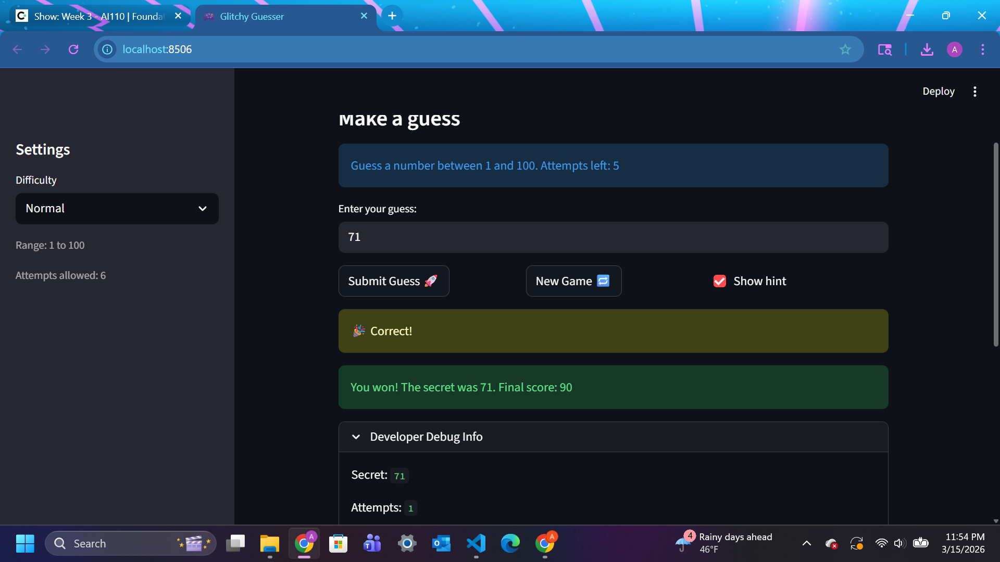
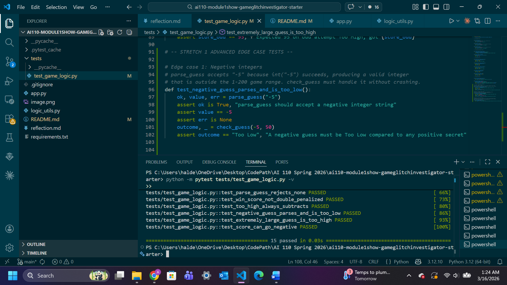

# 🎮 Game Glitch Investigator: The Impossible Guesser

## 🚨 The Situation

You asked an AI to build a simple "Number Guessing Game" using Streamlit.
It wrote the code, ran away, and now the game is unplayable. 

- You can't win.
- The hints lie to you.
- The secret number seems to have commitment issues.

## 🛠️ Setup

1. Install dependencies: `pip install -r requirements.txt`
2. Run the broken app: `python -m streamlit run app.py`

## 🕵️‍♂️ Your Mission

1. **Play the game.** Open the "Developer Debug Info" tab in the app to see the secret number. Try to win.
2. **Find the State Bug.** Why does the secret number change every time you click "Submit"? Ask ChatGPT: *"How do I keep a variable from resetting in Streamlit when I click a button?"*
3. **Fix the Logic.** The hints ("Higher/Lower") are wrong. Fix them.
4. **Refactor & Test.** - Move the logic into `logic_utils.py`.
   - Run `pytest` in your terminal.
   - Keep fixing until all tests pass!

## 📝 Document Your Experience

- [ ] Describe the game's purpose.

It is a guessing game in which the player tries to guess a number within a given range using a limited number of attempts. The range and the number of attempts depends on the chosen difficulty level: Easy, Normal, Hard. After each guess, the game provides a hint to the player to go higher or lower to guide them towards the correct number. Points are awarded based on how quickly the player guesses correctly.

- [ ] Detail which bugs you found.

BUG 1: When I guessed 1, the hint asked me to "Go LOWER" even though 1 is the minimum possible number, so I expected it to ask me to go higher. Similarly, when I guessed 100, the hint asked me to "Go HIGHER" even though 100 is the maximum possible number, so it should have asked me to go lower. Thus, the hints were backwards.

BUG 2: Difficulty level Easy had fewer attempts than difficulty level Normal, when I expected Normal to have fewer attempts than Easy.

BUG 3: Sidebar number of attempts does not match main window number of attempts when I open the game.

BUG 4: There is a mismatch between the ranges of Easy, Normal, Hard in the main window and sidebar.

BUG 5: I am unable to start a new game. When I press "New Game" I expected to be able to enter new guesses, but the page is stuck.

BUG 6: In the first guess, the number of attempts left does not decrease.

BUG 7: In the Developer Debug Info the history does not update immediately after each guess.

BUG 8: Hard range is 1-50, which is easier than the Normal range 1-100.

BUG 9: Invalid numbers like guesses outside the range or floating point values still accepted

BUG 10: Score calculations are off; for example, adds 5 points when too high but rewards 5 when too low.

- [ ] Explain what fixes you applied.

BUG 1 FIX (hints backwards): Using Claude Code suggestions, I changed the code to passing the secret as an integer, and flipped the messages for go higher when the guess is too low and go lower when the guess is too high.

BUG 2 FIX (difficulty level - attempts): According to the attempt_limit_map dictionary, the number of attempts for Easy was 6 and Normal was 8. Using Claude Code suggestions, I changed the key for "Easy" to 8 and "Normal" to 6.

BUG 3 FIX (attempts mismatch in sidebar and main window): According to the value of st.session_state.attempts, Main window attempts started at 1, while sidebar attempts started at 0. Using Claude Code suggestions, I changed the main window attempts to start at 0 by setting the value of st.session_state.attempts to 0. The sidebar number of attempts is supposed to be a fixed number that stays constant throughout the game.

BUG 4 FIX (difficulty level - ranges mismatch): For all difficulties the range was hardcoded to 1-100 for all difficulties. Using Claude Code suggestions, I changed the range to low-high to consider the appropriate range for each difficulty.

BUG 5 FIX (unable to start new game): Using Claude Code suggestions, I reset status to "playing" when new game starts and cleared the history of attempts.

BUG 6 FIX (first guess attempt does not decrease): Claude Code suggested the submit block does not update attempts display after first guess. Thus, I used st.empty() to create a placeholder for attempts display and update it after each guess.

BUG 7 FIX (history not updating): Using Claude Code suggestions, I moved the Developer Debug Info expander after the submit block.

BUG 8 FIX (Hard range easier than Normal): Using Claude Code suggestions, I changed the range for Hard to 1-200 in the get_range_for_difficulty function.

BUG 9 FIX (invalid numbers accepted): Using Claude Code suggestions, I made the parse_guess function display a message that the guess is unacceptable when the user enters a floating point value, and a message asking the user to input a number within the range if it is outside the range.

BUG 10 FIX (score off): Using Claude Code suggestions, I removed the +1 in the win points calculations because the attempt number was already incremented to 1. Additionally, I updated the points so that it subtracts 5 for both too high and too low values.

## 📸 Demo

Winning Game Screenshot:

Stretch Features - Challenge 1: Advanced Edge-Case Testing
Screenshot of 3 passed pytest cases (last 3 PASSED messages):

## 🚀 Stretch Features

- [ ] [If you choose to complete Challenge 4, insert a screenshot of your Enhanced Game UI here]
